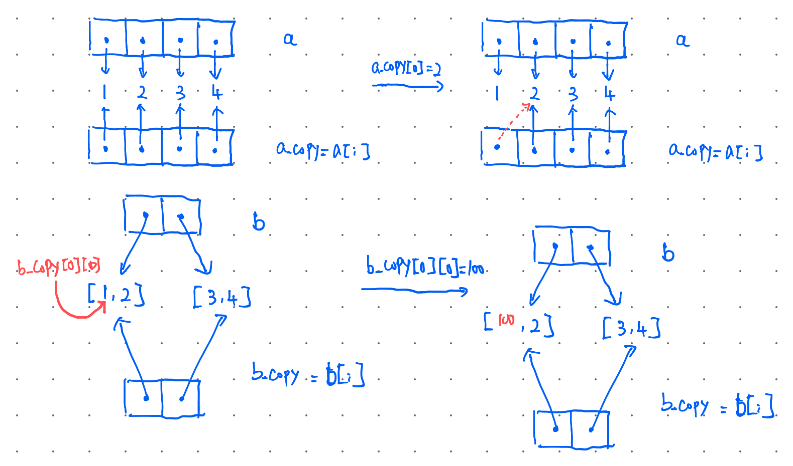

# Show all submodules

I need to import a particular function `formulate` from a file in the directory `<path-to-the-package>/coinor/dippy/examples/milp/milp_func`.
It's clear that I need to import it from the submodule `coinor.dippy`. But how to do it exactly?
Use following commands, which list all submodules you can import.

```python
import pkgutil
import coinor.dippy
package=coinor.dippy
for importer, modname, ispkg in pkgutil.walk_packages(path=package.__path__,
                                                      prefix=package.__name__+'.',
                                                      onerror=lambda x: None):
    print(modname)
```
Relavant outputs are
```python
.....
coinor.dippy.examples.milp
coinor.dippy.examples.milp.__main__
coinor.dippy.examples.milp.milp_func
.....
```

Then I can simply use

```python
from coinor.dippy.examples.milp.milp_func import formulate
```

# Using the right kernel for Jupyter Notebook

```bash
# create virtual env with python 3.7.7, whose name is cuppy
conda create -n cuppy numpy scipy pandas notebook matplotlib python=3.7.7 
# activate cuppy
conda activate cuppy
# I am using zsh, you may change to bash
conda init zsh 
# activate virtual env
cond activate cuppy
# point this verison of Python to jupyter
ipython kernel install --name "cuppy" --user
```

# Running Jupyter Notebook from the remote server

> Reference
> 1. [set up jupyter notebook on login nodes](https://ljvmiranda921.github.io/notebook/2018/01/31/running-a-jupyter-notebook/).
> 2. [set up jupyter notebook on computation nodes](https://benjlindsay.com/posts/running-jupyter-lab-remotely#running-on-a-compute-node)

**On the server side:**

* Create following two functions in the `.bashrc` and reload it using `source .bashrc`

  ```bash
  function Inode(){
    # provide the computation node name; default is polyp2
    local nodename="${1:-polyp2}"
    echo "starting an interactive section at $nodename"
    # start an interactive session in the given node
    qsub -l nodes=$nodename:ppn=4 -l walltime=1:00:00 -l mem=10gb,vmem=10gb -I
  }
  
  function jpt(){
    # provide the port; default is 1234
    local port="${1:-1234}"
    echo "open jupyter notebook at $(hostname):$port"
    # Fires-up a Jupyter notebook by supplying a specific port and ip
    jupyter notebook --no-browser --port=$port --ip=$(hostname)
  }
  ```

* In the server side's terminal, if
  
  * If you want to start the jupyter notebook in the login node, just call `jpt`;
  * If you want to start the jupyter notebook in the computation node, call `Inode` first and then when you are prompted to the computation node, then call `jpt`. For example, if the comutation node name is `polyp3`, then call `Inode polyp3` and then call `jpt 1234`.
  

**On the local side:**

* Create following two functions in the `.bashrc` and reload it using `source .bashrc`

  ```bash
  function jptt(){
      local localport="${1:-2234}"
      local servername="${2:-polyp1}"
      local serverport="${3:-1234}"
      # Forwards port $1 into port $3 and listens to it
      ssh -N -f -L localhost:$localport:$servername:$serverport yud319@polyps.ie.lehigh.edu
  }
  function stopjpt(){
    local localport="${1:-2234}"
    lsof -i tcp:$localport |awk 'NR > 1 {print $2}' | xargs kill -9
    echo "Kill port $localport"
  }
  ```
* Call `jptt` on the local terminal, which will listen to the jupyter notebook host on the server.
* In the browser, if the port on local side is set to `2234`, the just type `localhost::2234`.
* After finish the job, call `stopjpt`, which will free the local port.


# copy and deepcopy caveats

*  slicing in the list: slicing operator and assigning in Python makes a shallow copy of the sliced list. But the following example can be confusing.

```python
a = [1, 2, 3, 4]
a_copy = a[:]
a_copy[0] = 2
print(f"a:     {a}\na_copy:{a_copy}")

b = [[1,2], [3,4]]
b_copy = b[:]
b_copy[0][0] = 100
print(f"b:     {b}\nb_copy:{b_copy}")

c = [[1,2], [3,4]]
c_copy = c[:]
c_copy[0] = [-1, -1]
print(f"c:     {c}\nc_copy:{c_copy}")
```

**output:**

```
a:     [1, 2, 3, 4]
a_copy:[2, 2, 3, 4]
b:     [[100, 2], [3, 4]]
b_copy:[[100, 2], [3, 4]]
c:     [[1, 2], [3, 4]]
c_copy:[[-1, -1], [3, 4]]
```

**[explaination](https://stackoverflow.com/questions/19068707/does-a-slicing-operation-give-me-a-deep-or-shallow-copy)**: the original `list` is copied to a new `list` object. Just all elements within the `list` are not copied, so if the `list` contains a mutable object (`int`s are not mutable) changing that object will change it in both the original and the copied list because both have a copy of the reference to the same object.


