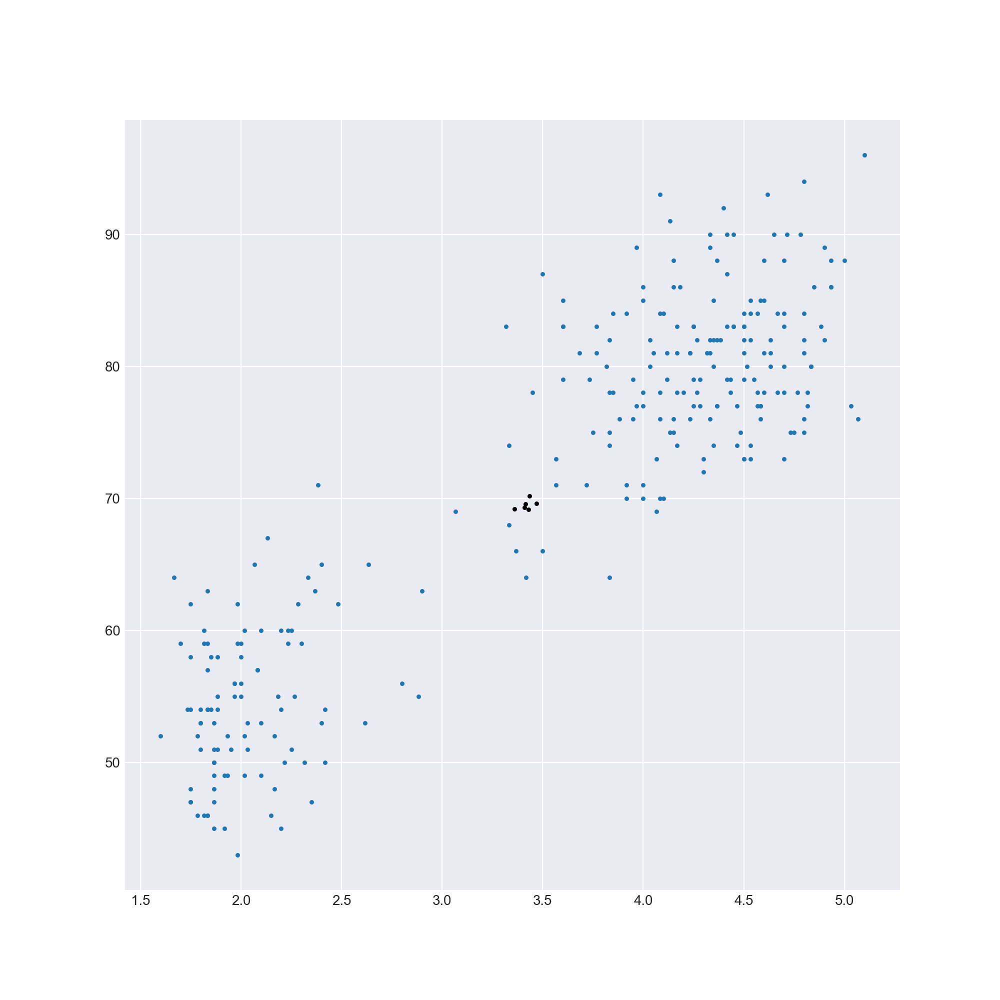
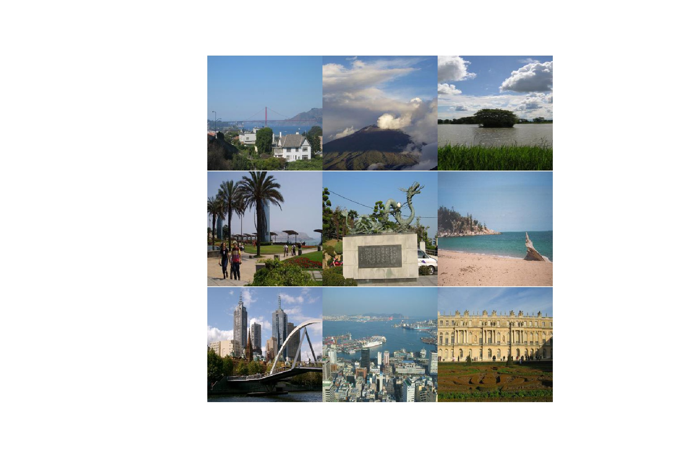

+++
# Date this page was created.
date = 2017-12-10T00:00:00

# Project title.
title = "Variational Gaussian Mixtures"

# Project summary to display on homepage.
summary = "Clustering under the variation inference framework."

# Tags: can be used for filtering projects.
# Example: `tags = ["machine-learning", "deep-learning"]`
tags = ["Data Analysis"]

# Optional external URL for project (replaces project detail page).
external_link = ""

# Does the project detail page use math formatting?
math = false

# Optional featured image (relative to `static/img/` folder).
[header]
#image = "headers/bubbles-wide.jpg"
#caption = "My caption :smile:"

+++

This is the statistical computing course final project, trying to understand, reporduce and extend some results reported in the paper, [Variational Inference: A Review for Statisticians](https://arxiv.org/pdf/1601.00670.pdf).

Three datasets are used here, simulated data, [old faithful](https://www.stat.cmu.edu/~larry/all-of-statistics/=data/faithful.dat) and [imageCLEF](https://www.imageclef.org).

Our final result looks like 

* Simulated data

* old faithful

* imageclef

For code and report please click [here](https://github.com/Rothdyt/Projects/tree/master/Show-and-tell).

