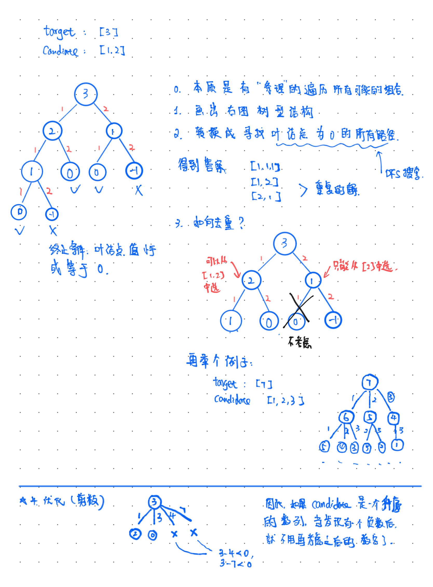
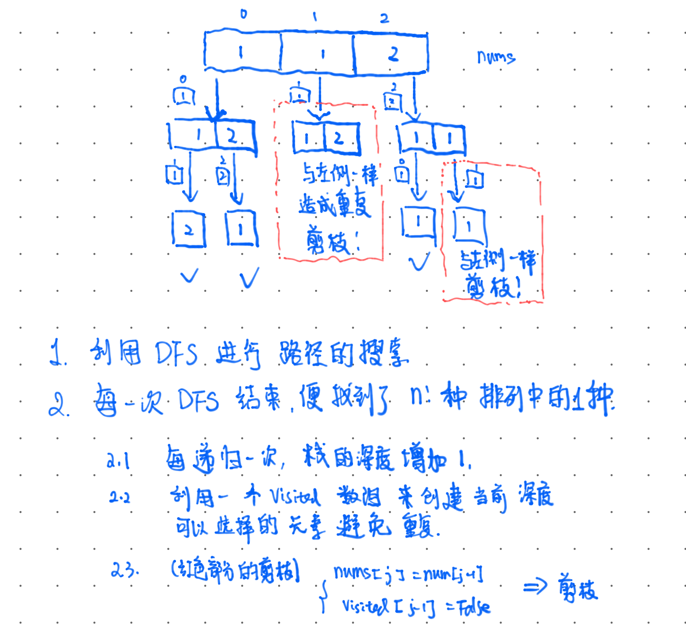

# 39. 组合总和

```
给定一个无重复元素的数组 candidates 和一个目标数 target ，找出 candidates 中所有可以使数字和为 target 的组合。

candidates 中的数字可以无限制重复被选取。

说明：

所有数字（包括 target）都是正整数。
解集不能包含重复的组合。 
示例 1：

输入：candidates = [2,3,6,7], target = 7,
所求解集为：
[
  [7],
  [2,2,3]
  ]
示例 2：

输入：candidates = [2,3,5], target = 8,
所求解集为：
[
  [2,2,2,2],
  [2,3,3],
  [3,5]
  ]


提示：

1 <= candidates.length <= 30
1 <= candidates[i] <= 200
candidate 中的每个元素都是独一无二的。
1 <= target <= 500


来源：力扣（LeetCode）
链接：https://leetcode-cn.com/problems/combination-sum
著作权归领扣网络所有。商业转载请联系官方授权，非商业转载请注明出处。
```

## 思路

第一接触回溯，看了几个思路和代码模板。然后再配合剪枝的思想。理解不够深刻，画图来解释下。以后做多了再来总结。


  
  
## 代码

```python
class Solution:
  def combinationSum(self, candidates: List[int], target: int) -> List[List[int]]:
    self.n = len(candidates)
    if self.n == 0:
    return []
    # pruning
    candidates.sort()
    self.candidates = candidates
    self.ans = []
    self.dfs(target, 0, [])
    return self.ans
  
  def dfs(self, target, start, path):
    if target == 0:
      self.ans.append(path.copy())
      return
    for i in range(start, self.n):
      residual = target - self.candidates[i]
      if residual < 0:
        break
      path.append(self.candidates[i])
      self.dfs(residual, i, path)
      path.pop()
      return
```

## 复杂度

带剪枝的不太会分析。。 不剪枝，得到一个非常不tight的上界是
* 时间: 设`h = (target / min(candidates)) , n = len(candidates)` 则 $O(n^h)$
* 空间: 不考虑返回数组的情况下，空间复杂度为栈的深度，所以为 $O(h)$.


# 题目: 40. 组合总和 II

```
给定一个数组 candidates 和一个目标数 target ，找出 candidates 中所有可以使数字和为 target 的组合。

candidates 中的每个数字在每个组合中只能使用一次。

说明：

所有数字（包括目标数）都是正整数。
解集不能包含重复的组合。 
示例 1:

输入: candidates = [10,1,2,7,6,1,5], target = 8,
所求解集为:
[
  [1, 7],
  [1, 2, 5],
  [2, 6],
  [1, 1, 6]
]
示例 2:

输入: candidates = [2,5,2,1,2], target = 5,
所求解集为:
[
  [1,2,2],
  [5]
]


来源：力扣（LeetCode）
链接：https://leetcode-cn.com/problems/combination-sum-ii
著作权归领扣网络所有。商业转载请联系官方授权，非商业转载请注明出处。
```

## 思路1: 建立带频次的 `candidates`的hash表

与39的思路几乎一样。区别在于：
1. 每个元素不能无限次使用
2. `candidates`里面有重复的

用一个`dict`可同时解决这两个问题。其中`key`是`candidates`中的元素, `value`是`candidates`中这个数字出现的频次。这样在建立回溯“树”时，通过检查当前元素剩余次数，来决定能否继续利用该元素接着建树。举个例子

```
如果 candidates = [2,3,2,5,6] 
则可以建立一个dict ={"2": 2, "3":1, "5":1, "6":1}。
```
在建立回溯“树”时"2" 最多可以使用2次, "3","5","6"则最多能使用1次。

3. 同时，为了达到剪枝的目的，我们需要`dict`中`key`是升序排列。

## 代码

```python
from collections import OrderedDict
class Solution:
    def combinationSum2(self, candidates: List[int], target: int) -> List[List[int]]:
        if not candidates:
            return []
        candidates.sort()
        self.freqTable = OrderedDict()
        self.ans = []
        for num in candidates:
            if num not in self.freqTable.keys():
                self.freqTable[num] = 1
            else:
                self.freqTable[num] += 1
        self.n_keys = len(self.freqTable)
        self.key_list = [* self.freqTable]
        self.dfs(target, [], 0)
        return self.ans
    
    def dfs(self, target, path, start):
        if target == 0:
            self.ans.append(path.copy())
            return
        for i in range(start, self.n_keys):
            # 当前candidates 中需要考察的元素
            num = self.key_list[i]
            # 该元素还可以继续使用
            if self.freqTable[num] > 0:
                residual = target - num
                # 剪枝
                if residual < 0:
                    break
                else:
                    self.freqTable[num] -= 1
                    path.append(num)
                    self.dfs(residual, path, i)
                    path.pop()
                    self.freqTable[num] += 1
        return
```

## 复杂度

带剪枝的不太会分析。。 不剪枝，得到一个非常不tight的上界是
* 时间: 设`h` 为树的深度, `n = len(candidates)` 则 $O(n^h)$
* 空间: 不考虑返回数组的情况下，空间复杂度为栈的深度，所以为 $O(h)$.

## 思路二：lucifer的代码 

根本没必要玩花的，只需要保证每次从`target`中减去的数和上一次减去的数不一样就好了。然后将index 向右移动一位避免重复使用。【其实没说清楚，看代码吧。。】

```python
class Solution:
    def combinationSum2(self, candidates: List[int], target: int) -> List[List[int]]:
        """
        与39题的区别是不能重用元素，而元素可能有重复；
        不能重用好解决，回溯的index往下一个就行；
        元素可能有重复，就让结果的去重麻烦一些；
        """
        size = len(candidates)
        if size == 0:
            return []

        # 还是先排序，主要是方便去重
        candidates.sort()

        path = []
        res = []
        self._find_path(candidates, path, res, target, 0, size)

        return res

    def _find_path(self, candidates, path, res, target, begin, size):
        if target == 0:
            res.append(path.copy())
        else:
            for i in range(begin, size):
                left_num = target - candidates[i]
                if left_num < 0:
                    break
                # 如果存在重复的元素，前一个元素已经遍历了后一个元素与之后元素组合的所有可能
                if i > begin and candidates[i] == candidates[i-1]:
                    continue
                path.append(candidates[i])
                # 开始的 index 往后移了一格
                self._find_path(candidates, path, res, left_num, i+1, size)
                path.pop()
```

#  47. 全排列II

```
给定一个可包含重复数字的序列 nums ，按任意顺序 返回所有不重复的全排列。

示例 1：

输入：nums = [1,1,2]
输出：
[[1,1,2],
 [1,2,1],
 [2,1,1]]
示例 2：

输入：nums = [1,2,3]
输出：[[1,2,3],[1,3,2],[2,1,3],[2,3,1],[3,1,2],[3,2,1]]
 

提示：

1 <= nums.length <= 8
-10 <= nums[i] <= 10


来源：力扣（LeetCode）
链接：https://leetcode-cn.com/problems/permutations-ii
著作权归领扣网络所有。商业转载请联系官方授权，非商业转载请注明出处。
```

## 思路




## 代码
```python
from copy import deepcopy
class Solution:
    def permuteUnique(self, nums: List[int]) -> List[List[int]]:
        self.n = len(nums)
        if self.n == 0:
            return []
        nums.sort()
        self.nums = nums
        self.ans = []
        visited = [False] * self.n
        self.dfs(0, [], visited)
        return self.ans
    def dfs(self, i, path, visited):
        # i is the recursion depth counter
        if i == self.n:
            self.ans.append(deepcopy(path))
            return
        for j in range(self.n):
            if visited[j]:
                continue
            if j > 0 and self.nums[j-1] == self.nums[j] and not visited[j-1]:
                continue
            visited[j] = True
            path.append(self.nums[j])
            self.dfs(i+1, path, visited)
            visited[j] = False
            path.pop(-1)
        return
```

## 复杂度

* 时间复杂度 $O(n*n!)$
* 空间复杂度 $O(n)$
