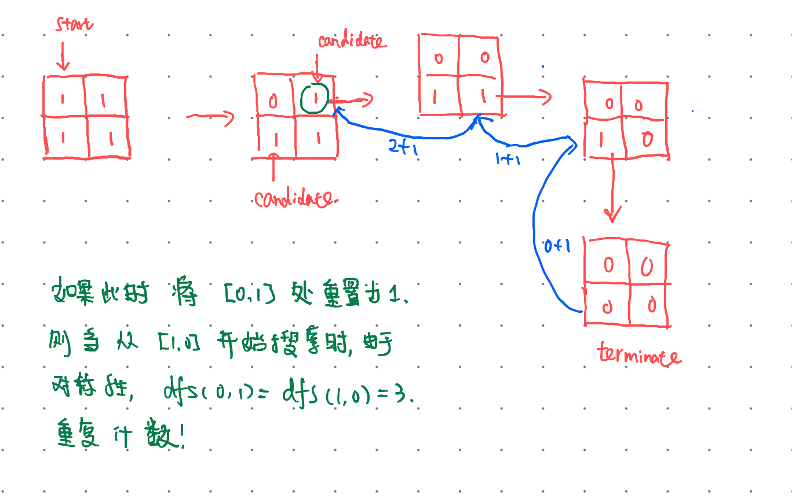

# 695. 岛屿的最大面积

```
给定一个包含了一些 0 和 1 的非空二维数组 grid 。

一个 岛屿 是由一些相邻的 1 (代表土地) 构成的组合，这里的「相邻」要求两个 1 必须在水平或者竖直方向上相邻。你可以假设 grid 的四个边缘都被 0（代表水）包围着。

找到给定的二维数组中最大的岛屿面积。(如果没有岛屿，则返回面积为 0 。)

 

示例 1:

[[0,0,1,0,0,0,0,1,0,0,0,0,0],
 [0,0,0,0,0,0,0,1,1,1,0,0,0],
 [0,1,1,0,1,0,0,0,0,0,0,0,0],
 [0,1,0,0,1,1,0,0,1,0,1,0,0],
 [0,1,0,0,1,1,0,0,1,1,1,0,0],
 [0,0,0,0,0,0,0,0,0,0,1,0,0],
 [0,0,0,0,0,0,0,1,1,1,0,0,0],
 [0,0,0,0,0,0,0,1,1,0,0,0,0]]
对于上面这个给定矩阵应返回 6。注意答案不应该是 11 ，因为岛屿只能包含水平或垂直的四个方向的 1 。

示例 2:

[[0,0,0,0,0,0,0,0]]
对于上面这个给定的矩阵, 返回 0。

 

注意: 给定的矩阵grid 的长度和宽度都不超过 50。
```


## 思路

1. 利用dfs搜索，如果在从(i,j)处开始（假设`grid[i][j]=1`）寻找最多连通的小岛，为其左，右，上, 下，开始搜索最多连通小岛数之和再加一。
2. 需要防止重复计数。具体做法就是再访问一个点后就永远将其设置为`0`。考虑下面这个例子，如果访问完一个位置后，将其重置为1，就会重复计数: `dfs(0,0)=3+3+1=7`错误答案。




## 代码

```python
class Solution:
    def maxAreaOfIsland(self, grid: List[List[int]]) -> int:
        m = len(grid)
        if m == 0:
            return 0
        n = len(grid[0])
        if n == 0:
            return 0
        memory = [[0 for j in n] for i in m]
        def dfs(i,j):
            if i<0 or i>=m or j<0 or j>=n: return 0
            if grid[i][j] == 0: return 0
            grid[i][j] = 0
            left = dfs(i, j-1)
            right = dfs(i, j+1)
            up = dfs(i-1, j)
            down = dfs(i+1, j)
            return 1 + left + right + up + down
        ans = 0
        for i in range(m):
            for j in range(n):
                ans = max(ans, dfs(i,j))
        return ans
```

## 复杂度

时间复杂度：$O(mn)$
空间复杂度：$O(mn)$ （递归栈深度）

# 1162. 地图分析

```
你现在手里有一份大小为 N x N 的 网格 grid，上面的每个 单元格 都用 0 和 1 标记好了。其中 0 代表海洋，1 代表陆地，请你找出一个海洋单元格，这个海洋单元格到离它最近的陆地单元格的距离是最大的。

我们这里说的距离是「曼哈顿距离」（ Manhattan Distance）：(x0, y0) 和 (x1, y1) 这两个单元格之间的距离是 |x0 - x1| + |y0 - y1| 。

如果网格上只有陆地或者海洋，请返回 -1。

 

示例 1：


输入：[[1,0,1],[0,0,0],[1,0,1]]
输出：2
解释： 
海洋单元格 (1, 1) 和所有陆地单元格之间的距离都达到最大，最大距离为 2。
示例 2：


输入：[[1,0,0],[0,0,0],[0,0,0]]
输出：4
解释： 
海洋单元格 (2, 2) 和所有陆地单元格之间的距离都达到最大，最大距离为 4。
 

提示：

1 <= grid.length == grid[0].length <= 100
grid[i][j] 不是 0 就是 1
```
## 思路

1. 不难发现海洋`(i, j)`离最近陆地的距离依赖于其上下左右邻居的位置。
2. 最开始想到用dfs 来找，然后发现有很多坑。于是考虑用bfs的写法，从(i,j)开始寻找其上下左右邻居是否唯一，类似于二叉树带层数记忆的层次遍历，找到的第一个陆地即为答案，不需要queue为空才退出。

```python
class Solution(object):
    def maxDistance(self, grid):
        m = len(grid)
        if m == 0: return 0
        n = len(grid[0])
        if n == 0: return 0
        # memory = [[0 for j in range(n)] for i in range(m)]
            
        def bfs(i,j):
            queue = [(i,j,0)]
            visited = [[0 for j in range(n)] for i in range(m)]
            while queue:
                i,j, step = queue.pop(0)
                visited[i][j] = 1
                move = [(0,-1), (0,1), (-1,0), (1,0)]
                for dxdy in move:
                    newi, newj = i+dxdy[0], j+dxdy[1]
                    if ( (newi>=0) and (newi<m) and (newj>=0) and (newj<n)):
                        if  grid[newi][newj] == 1:
                            return step + 1
                        else:
                            if visited[newi][newj] != 1:
                                queue.append((newi, newj, step+1))
            return -1
                
        stepMax = -1
        for i in range(m):
            for j in range(n):
                if grid[i][j] != 1:
                    stepMax = max(stepMax, bfs(i,j))
        return stepMax
```

可惜这种写法超时了，因为我们会重复遍历很多相同的格子。时间复杂度为 $O(m^2n^2)$。

看了[题解](https://github.com/leetcode-pp/91alg-2/blob/master/solution/topic/d76.as-far-from-land-as-possible.md)，感觉十分巧妙，让所有小岛进入queue，然后从小岛开始向周围扩散，能扩散的最远距离即为答案。

## 代码

```python
class Solution(object):
    def maxDistance(self, grid):
        m = len(grid)
        if m == 0: return 0
        n = len(grid[0])
        if n == 0: return 0
        queue = [(i, j) for i in range(m) for j in range(n) if grid[i][j] == 1]
        if len(queue) == 0 or len(queue) == m * n: return -1
        step = 0
        while queue:
            move = [(0,-1), (0,1), (-1,0), (1,0)]
            for _ in range(len(queue)):
                i,j = queue.pop(0)
                for dxdy in move:
                    newi, newj = i+dxdy[0], j+dxdy[1]
                    if ( (newi>=0) and (newi<m) and (newj>=0) and (newj<n) and grid[newi][newj] == 0):
                        queue.append((newi, newj))
                        grid[newi][newj] = 1
            step += 1
        # 这里小心点，和计数方式有关
        return step - 1
```

## 复杂度

* 时间复杂度：$O(n^2)$
* 空间复杂度：$O(n^2)$

# 113. 路径总和 II

```
给定一个二叉树和一个目标和，找到所有从根节点到叶子节点路径总和等于给定目标和的路径。

说明: 叶子节点是指没有子节点的节点。

示例:
给定如下二叉树，以及目标和 sum = 22，

              5
             / \
            4   8
           /   / \
          11  13  4
         /  \    / \
        7    2  5   1
返回:

[
   [5,4,11,2],
   [5,8,4,5]
]
```

## 思路

dfs 遍历整颗树，记住整条路上的所有元素，到叶节点时判断下和是否为要求的值。

之前还想通过当前从root到当前node 上path之和来剪枝，然后发现居然可以有负值的node 和 负值的sum。

## 代码

```python
from copy import deepcopy
class Solution(object):
    def pathSum(self, root, sum):
        """
        :type root: TreeNode
        :type sum: int
        :rtype: List[List[int]]
        """
        if not root:
            return []
        ans = []
        def dfs(node, path, target):
            path.append(node.val)
            if node.left == None and node.right == None and target == node.val:
                ans.append(deepcopy(path))
                path.pop(-1)
                return
            if node.left == None and node.right == None and target != node.val:
                path.pop(-1)
                return
            if node.left:
                dfs(node.left, path, target-node.val)
            if node.right:
                dfs(node.right, path, target-node.val)
            path.pop(-1)
            return
        dfs(root, [], sum)
        return ans
```

## 复杂度

* 时间： $O(n)$ 节点数
* 空间：不算返回的答案的话 $O(\log_2(n))$ 栈深度


# 301. 删除无效的括号

```
删除最小数量的无效括号，使得输入的字符串有效，返回所有可能的结果。

说明: 输入可能包含了除 ( 和 ) 以外的字符。

示例 1:

输入: "()())()"
输出: ["()()()", "(())()"]
示例 2:

输入: "(a)())()"
输出: ["(a)()()", "(a())()"]
示例 3:

输入: ")("
输出: [""]
```

## 思路

[参考题解](https://leetcode-cn.com/problems/remove-invalid-parentheses/solution/bfsjian-dan-er-you-xiang-xi-de-pythonjiang-jie-by-/)
BFS
1. 每次从字符串中删除一个括号字符，并列举出所有可能的结果，用`set()`存储避免重复情况出现
2. 判断列举出的所有结果是否有有效的字符串，如果有直接返回有效字符串
3. 如果没有有效字符串，说明删除的字符还不够多，再删除一个括号字符，列举出所有可能的结果
4. 继续判断列举出的所有结果中是否有有效字符，如果有直接返回有效字符串
5. 一直循环以上`删除一个字符-->判断是否有有效字符串`的步骤，直到找到有效字符串为止

## 代码

```python
class Solution(object):
    def removeInvalidParentheses(self, s):
        """
        :type s: str
        :rtype: List[str]
        """
        def isValid(string):
            count = 0
            for char in string:
                if char == '(':
                    count += 1
                if char == ')':
                    count -= 1
                if count < 0:
                    return False
            if count>0:
                return False
            else:
                return True
        current_level = {s}
        while True:
            ans = filter(isValid, current_level)
            if ans:
                return ans
            next_level = set()
            for item in current_level:
                for i in range(len(item)):
                    if item[i] in '()':
                        next_level.add(item[:i] + item[i+1:])
            current_level = next_level
```
##  复杂度

* 时间复杂度：$O(2^n)$
* 空间复杂度：$O(n!)$


